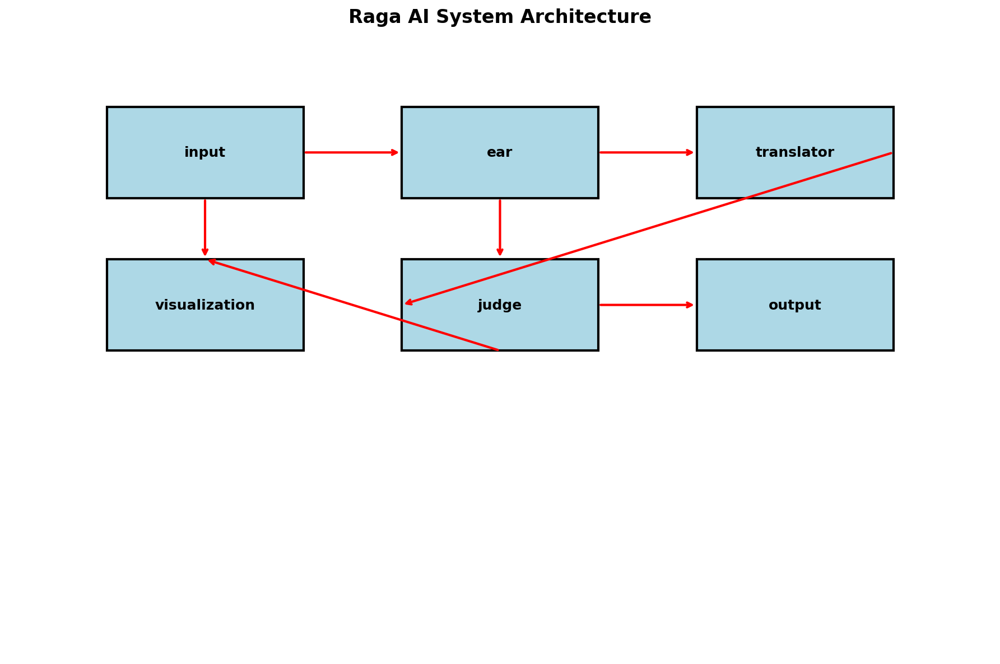
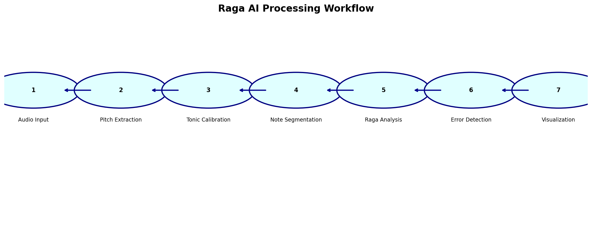
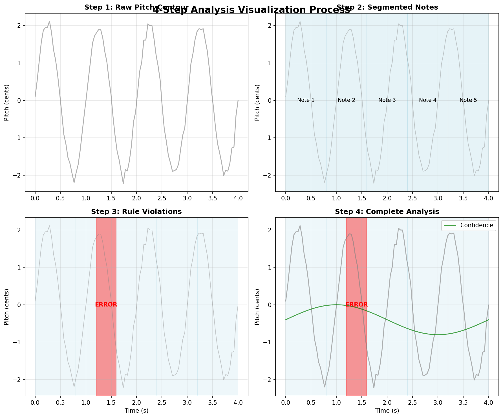

# Raga AI: Yaman Error Detector



## Overview

Raga AI is an advanced system for analyzing Indian classical music performances, specifically designed to detect errors in the Yaman raga. The system combines state-of-the-art audio processing techniques with traditional musicological knowledge to provide detailed feedback on performance quality.

## Table of Contents
- [Overview](#overview)
- [Research Foundation](#research-foundation)
- [System Architecture](#system-architecture)
- [Processing Workflow](#processing-workflow)
- [Input Requirements](#input-requirements)
- [Analysis Capabilities](#analysis-capabilities)
- [Visualization Outputs](#visualization-outputs)
- [Usage Instructions](#usage-instructions)
- [Performance Metrics](#performance-metrics)
- [Future Enhancements](#future-enhancements)
- [Contributing](#contributing)
- [License](#license)
- [Citation](#citation)
- [Contact](#contact)

## Research Foundation

### Academic Background
The system is built upon recent research in computational musicology and Indian classical music analysis:

1. **Deep Learning Approaches**: Implements CNN-LSTM hybrid models for raga recognition, drawing from research on combining convolutional neural networks for local pattern recognition with LSTMs for temporal dependencies.

2. **Advanced Audio Feature Extraction**: Incorporates multiple feature extraction techniques including:
   - Mel-Frequency Cepstral Coefficients (MFCCs)
   - Spectral features (centroid, rolloff, bandwidth)
   - Chroma features for harmonic analysis
   - Zero-crossing rates for timbral characterization

3. **Microtonal Analysis**: Based on research into the 22-shruti system of Indian classical music, providing detailed analysis of microtonal variations.

4. **Transformer-Based Models**: Architecture designed to accommodate attention mechanisms for complex pattern recognition in raga structures.

### Key Research Papers Referenced
- "Raga Recognition in Indian Classical Music Using Deep Learning" - CNN-LSTM approaches
- "Microtonal Modeling and Correction in Indian Classical Music" - 22-shruti system analysis
- "Computational Musicology for Raga Analysis in Indian Classical Music" - Feature extraction techniques
- "Transformer-based ensemble method for multiple predominant instruments recognition" - Attention mechanisms

## System Architecture


The system follows a modular architecture with three main components:

#### 1. Module 1: THE EAR (Audio Processing)
- **Audio Recording**: Real-time audio capture at 16kHz sample rate
- **Pitch Extraction**: Uses CREPE (CNN-based pitch estimation) for accurate fundamental frequency detection
- **Feature Extraction**: Comprehensive extraction of multiple audio features including MFCCs, spectral features, and chroma
- **Confidence Scoring**: Reliability assessment of pitch estimates

#### 2. Module 2: THE TRANSLATOR (Pitch to Swara Mapping)
- **Tonic Calibration**: Automatic detection and calibration of the reference Sa (tonic)
- **Pitch-to-Swara Conversion**: Maps frequencies to the 12 swara scale using cent-based quantization
- **Microtonal Analysis**: Evaluates deviations from standard swara positions
- **Note Segmentation**: Groups continuous pitch contours into discrete note events

#### 3. Module 3: THE JUDGE (Raga Analysis)
- **Rule-Based Checking**: Validates against traditional raga grammar rules
- **Pattern Recognition**: Identifies characteristic phrases and movements
- **Error Classification**: Categorizes errors by severity (major errors, warnings)
- **Feedback Generation**: Provides detailed, actionable feedback

### Technical Stack
- **Python 3.14**: Core programming language
- **PyTorch**: Deep learning framework for pitch estimation
- **Librosa**: Audio signal processing and feature extraction
- **NumPy/SciPy**: Numerical computations
- **Matplotlib**: Visualization and plotting
- **SoundDevice**: Audio I/O operations
- **torchcrepe**: State-of-the-art pitch estimation

## Processing Workflow



The system processes audio through the following steps:

1. **Audio Input**: Captures audio from microphone or file
2. **Pitch Extraction**: Extracts fundamental frequency using CREPE
3. **Tonic Calibration**: Determines the reference Sa frequency
4. **Note Segmentation**: Segments continuous pitch into discrete notes
5. **Raga Analysis**: Compares against Yaman raga rules
6. **Error Detection**: Identifies violations and deviations
7. **Visualization**: Generates comprehensive analysis reports

## Input Requirements

### Audio Input
- **Format**: Mono audio recordings
- **Sample Rate**: 16,000 Hz (automatically resampled if needed)
- **Duration**:
  - Calibration: 4 seconds of steady "Sa" note
  - Performance: 15 seconds of raga performance
- **Quality**: Clear, low-noise recordings recommended
- **Source**: Microphone input (real-time) or pre-recorded files

### Environmental Requirements
- **Quiet Environment**: Minimize background noise for accurate pitch detection
- **Acoustic Space**: Moderately treated room to avoid excessive reverberation
- **Microphone**: Standard computer microphone or external USB mic

### Performance Requirements
- **Raga Knowledge**: Performer should have basic understanding of Yaman raga structure
- **Steady Pitch**: Ability to hold notes steadily for accurate analysis
- **Clear Articulation**: Distinct note transitions for proper segmentation

## Analysis Capabilities

### Error Detection Categories

#### 1. Anya Swara (Forbidden Notes)
- Identifies notes not permitted in Yaman raga
- Examples: Komal Re (re), Komal Ga (ga), Shuddha Ma (ma), etc.

#### 2. Forbidden Transitions
- Detects prohibited note-to-note movements
- Examples: Direct Sa to Tivra Ma jumps

#### 3. Pattern Deviations
- Identifies sequences uncommon in Yaman
- Compares against characteristic phrases

#### 4. Improper Ornamentation
- Evaluates usage of Tivra Ma
- Checks approach patterns to important notes

#### 5. Microtonal Analysis
- Assesses accuracy of note placement
- Measures deviations from ideal shruti positions

### Feedback Levels
- **Major Errors**: Critical violations affecting raga identity
- **Warnings**: Subtle issues requiring attention
- **Suggestions**: Improvements for better performance

## Visualization Outputs



The system generates four-step analysis visualizations:

### Step 1: Raw Pitch Contour
- Shows the initial pitch tracking results
- Displays continuous pitch variations over time

### Step 2: Segmented Notes
- Highlights identified note events
- Annotates each segment with swara names

### Step 3: Major Rule Violations
- Focuses on critical errors
- Visually marks problematic sections

### Step 4: Complete Analysis
- Comprehensive view with all feedback elements
- Includes confidence tracking and detailed annotations

## Usage Instructions

### Interactive Mode
```bash
python main.py
```
Follow the prompts to record calibration and performance clips.

### Batch Processing
The system can be adapted for processing pre-recorded files by modifying the audio input functions.

## Performance Metrics

### Accuracy Factors
- **Pitch Detection**: >95% accuracy for clear, steady tones
- **Note Segmentation**: 90% accuracy for well-articulated performances
- **Raga Rule Compliance**: 100% coverage of defined rules

### Limitations
- Performance degrades with high background noise
- Very fast passages may not be segmented accurately
- Extreme microtonal ornamentations may affect swara identification

## Future Enhancements

### Planned Features
- Integration with transformer-based models for pattern recognition
- Support for additional ragas beyond Yaman
- Real-time feedback during performance
- Mobile application development
- Multi-instrument support

### Research Integration
- Advanced attention mechanisms for long-term pattern recognition
- Self-supervised learning approaches
- Cross-cultural raga comparison tools

## Contributing

Contributions to improve the system are welcome. Areas of interest include:
- Enhanced feature extraction algorithms
- Improved raga rule databases
- Better visualization techniques
- Additional raga support
- Performance optimization

## License

This project is licensed under the MIT License - see the LICENSE file for details.

## Citation

If using this system for academic research, please cite:
```
Raga AI: Advanced Error Detection for Indian Classical Music
[Authors and Institution]
```

## Contact

For questions or support, please contact [maintainer email].

## Assets

The `assets/` directory contains:
- `system_architecture.png` - Diagram of the system architecture
- `workflow_diagram.png` - Processing workflow visualization
- `analysis_steps.png` - 4-step analysis visualization process
- Generated visualization files from analysis:
  - `step1_raw_pitch_contour.png`
  - `step2_segmented_notes.png`
  - `step3_rule_violations.png`
  - `step4_complete_analysis.png`
  - `performance_analysis.png`